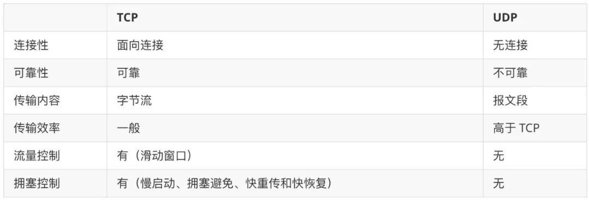

---
group:
  title: 网络基础
  order: 4
---

# 网络基础

## OSI 七层模型和 TCP/IP 四层模型？TCP、HTTP 分别是哪一层？

https://zhuanlan.zhihu.com/p/152590226

## TCP 三次握手、四次挥手

https://juejin.cn/post/6844903625513238541

https://www.zhihu.com/question/63264012

## TCP/UDP 的区别

## TCP 重传机制、滑动窗口、流量控制、拥塞控制

https://www.cnblogs.com/xiaolincoding/p/12732052.html

## 简述 https 原理，以及与 http 的区别？

https://cloud.tencent.com/developer/article/1005197

https://www.huaweicloud.com/zhishi/edit-582356.html

## http2 和 http1 的区别？

https://coffe1891.gitbook.io/frontend-hard-mode-interview/1/1.5.3
https://network.51cto.com/article/634943.html

## Charles 为什么可以劫持和更改 https 的请求，它的原理是什么？https 中间被篡改了怎么识别？

https://www.zhihu.com/question/65464646/answer/1962705118

## 你知道哪些 http 头部？

https://zhuanlan.zhihu.com/p/135947893

## 在交互过程中如果数据传送完了，还不想断开连接怎么办，怎么维持？

在 HTTP 中响应体的 Connection 字段指定为 keep-alive

## HTTP 常用的状态码及使用场景？302 301 307 之间的区别？301 和 302 对于 seo 来说哪个更好？

https://juejin.cn/post/6844904202863394830

301 永久重定向，302 临时重定向，307 的定义实际上和 302 是一致的，唯一的区别在于，307 状态码不允许浏览器将原本为 POST 的请求重定向到 GET 请求上

## http 缓存和 CDN 原理？

https://juejin.cn/post/6844903709982490638

## 怎么与服务端保持连接？

https://blog.csdn.net/weixin_44135121/article/details/103402626

## http 请求跨域是什么？有哪些解决跨域的方法？

https://www.jianshu.com/p/f880878c1398

## jsonp 有什么缺点？

https://www.jianshu.com/p/a17cb17d3bba

## get/post 请求区别？

https://www.runoob.com/tags/html-httpmethods.html

## DNS 解析是去哪找的缓存？怎么找到 DNS 服务器？DNS 怎么解析出 IP 的？解析出 ip 地址后怎么找到对方？

https://cloud.tencent.com/developer/news/324975

## WebSocket、Ajax、Fetch API 区别？

https://segmentfault.com/a/1190000021741131

https://zhuanlan.zhihu.com/p/58062212

（1.featch 已经试验性支持 abort 了，但不兼容 IE；2.fetch 进度事件目前还是无法支持）

## WebSocket 的握手过程？

https://openrad.ink/2021/11/14/websocket%E6%8F%A1%E6%89%8B%E8%BF%87%E7%A8%8B%EF%BC%8C%E5%92%8Csocket%E7%9A%84%E5%8C%BA%E5%88%AB/

## DDOS 攻击？

https://www.zhihu.com/question/22259175
